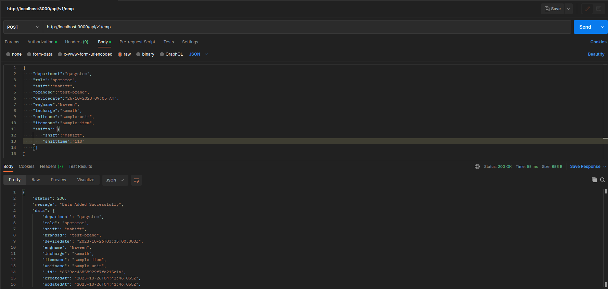
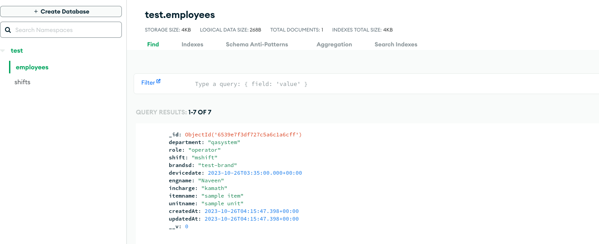
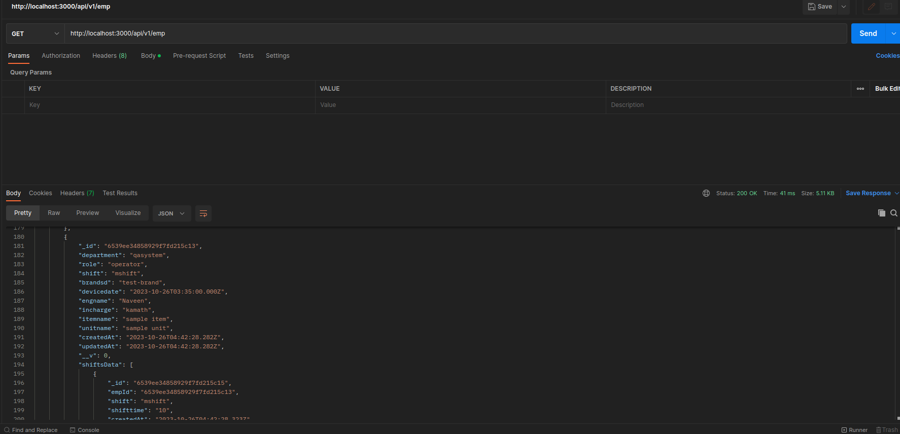

# API Endpoints
1. POST -> http://localhost:3000/api/v1/emp (To capture form information)
2. GET -> http://localhost:3000/api/v1/emp  (To get all list of all data that we have captured through the form)

# Working Screenshots
1. 
Here, post api is hit and document is saved successfully.

DB Screeshot , here 2 collections will be created employees and shifts.

2. 
Here, get api is hit and list of data is retrieved successfully.